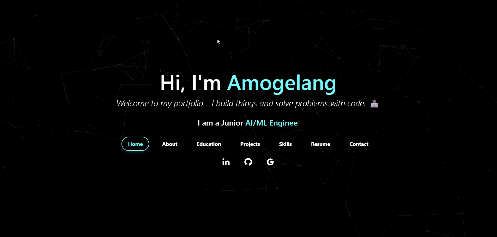
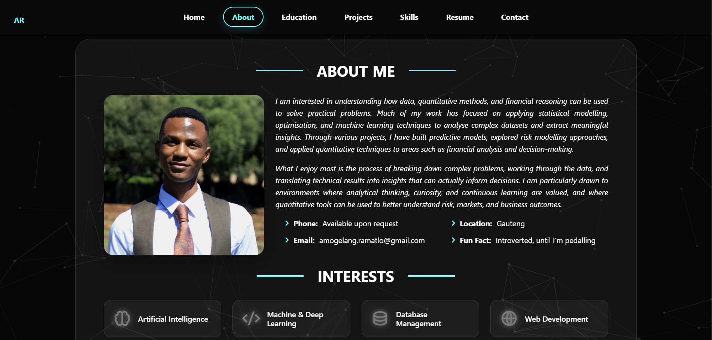
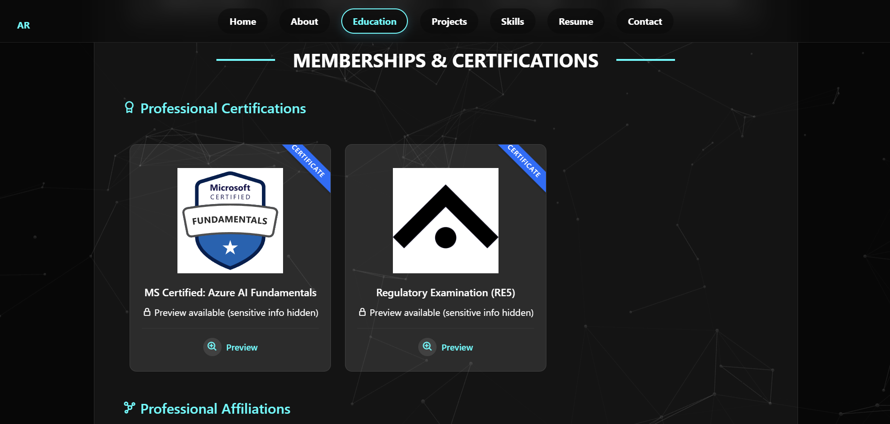
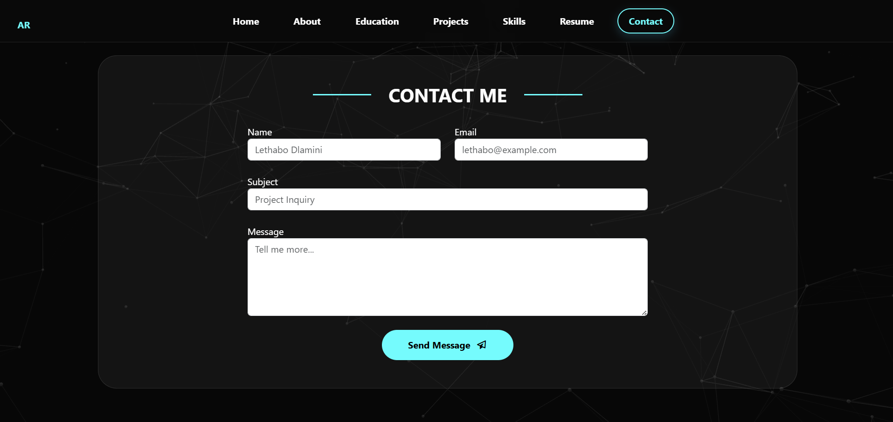

# Amogelang Ramatlo – Professional Portfolio

[](https://amogelang-ramatlo.github.io)
[](https://opensource.org/licenses/MIT)

> **Live Site:** [amogelang-ramatlo.github.io](https://amogelang-ramatlo.github.io)

This repository contains the source code for my personal and professional portfolio website. It serves as a central hub for my Curriculum Vitae, and data science projects. 

The site is designed with a focus on clean typography, responsive layout, and data security, utilizing a modern "glass-morphism" aesthetic.

## 🛠️ Technical Architecture & Stack

This project is built using vanilla web technologies to ensure fast load times, zero dependencies on heavy JavaScript frameworks, and seamless deployment.

* **Frontend:** HTML5, CSS3, JavaScript (ES6+)
* **Styling Framework:** Bootstrap 5 (Grid system & Modals)
* **UI/UX Elements:** Custom Glass-morphism CSS, Boxicons
* **Form Handling:** [Web3Forms](https://web3forms.com/) integration for serverless, distraction-free contact routing.
* **Hosting & CI/CD:** GitHub Pages

## 🔑 Key Features

* **Interactive Credential Viewer:** Implemented a secure, dynamic modal system for previewing professional certificates (e.g., ASSA, RE5, Azure). Uses a JavaScript-driven image swapping architecture to display redacted credentials, ensuring privacy while verifying qualifications.
* **Serverless Contact Architecture:** Features a contact system integrated with the Web3Forms API. This setup handles form submissions securely without a backend server, utilizing AJAX for a seamless user experience, honeypot fields for spam protection, and custom success notifications.
* **Responsive Grid System:** Fully optimized for mobile, tablet, and desktop viewing using CSS Flexbox and Bootstrap's responsive grid.
* **Semantic Accessibility:** Structured with clear ARIA labels and semantic HTML to ensure compatibility with screen readers and accessibility tools.

## 🚀 Local Development Setup

To run this project locally for testing or modification:
   
#### Step 1
- **Option 1**
    - 🍴 Fork this repo!
- **Option 2**
    - 👯 Clone this repo to your local machine.
    - ```bash
      git clone [https://github.com/amogelang-ramatlo/amogelang-ramatlo.github.io.git](https://github.com/amogelang-ramatlo/amogelang-ramatlo.github.io.git)

#### Step 2
- **Build your code** 🔨🔨🔨

#### Step 3
- 🔃 Create a new pull request.


## Website Preview

#### Home Page


#### About Page


#### Education Page


#### Contact Page



## Sections 📚
✔️ About\
✔️ Interests\
✔️ Education\
✔️ Certifications\
✔️ Projects\
✔️ Skills\
✔️ Resume\
✔️ Contact
